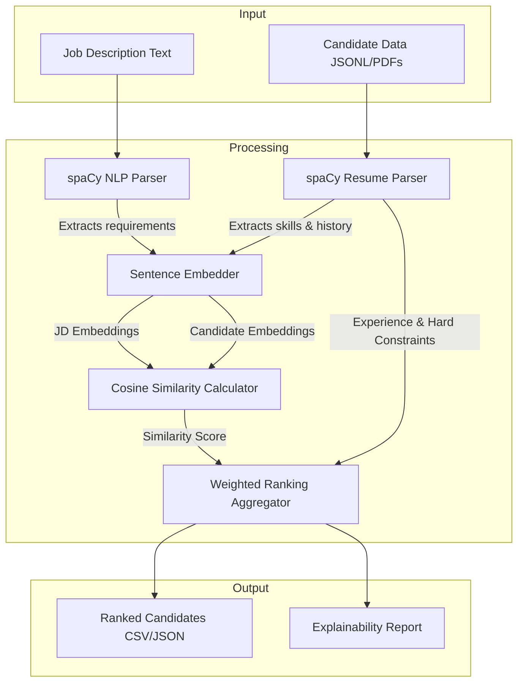

# AI Candidate Ranking System for Hiring

[](https://www.python.org/)
[](https://huggingface.co/sentence-transformers)
[](LICENSE)

An AI-powered recruitment engine designed to automatically understand job descriptions and rank candidate profiles using semantic relevance. Instead of relying on shallow, exact-match keywords, this system leverages advanced Natural Language Processing (NLP) and vector embeddings to identify candidates whose actual experience and skills conceptually align with the requirements of a role.

---

## Project Overview

### The Problem with Keyword-Based Hiring
Traditional Applicant Tracking Systems (ATS) rely heavily on keyword matching. This approach is fundamentally broken for several reasons:
* **The Synonym Gap:** A candidate with "Deep Learning" on their resume might be filtered out if the job description specifically asks for "Neural Networks," despite the skills being highly related.
* **Keyword Stuffing:** Candidates can easily game legacy systems by packing irrelevant buzzwords into their CVs, causing unqualified profiles to rank artificially high.
* **Lack of Context:** Keyword search counts frequencies but fails to evaluate the context, recency, or depth of a candidate's experience.

### Our Solution
This system replaces string matching with **semantic matching**. By representing both job descriptions and candidate profiles in a multi-dimensional vector space, we capture the semantic meaning of their contents. A candidate with transferable skills or equivalent experience is recognized and ranked appropriately, while keyword-stuffed resumes that lack substance are deprioritized.

---

## Features

* **Job Description Understanding:** Uses NLP to parse job descriptions, automatically extracting key technical skills, experience requirements, soft skills, and role levels.
* **Candidate Profile Analysis:** Extracts and structures candidate resumes, analyzing skills, duration of roles, career progression, and quality signals (e.g., leadership roles or rapid transitions).
* **Semantic Matching:** Maps candidates and job descriptions into a shared embedding space to compute conceptual similarity scores.
* **Explainable Output:** Generates clear, human-readable explanations detailing exactly *why* a candidate ranked higher (e.g., highlighting semantic alignment of their past projects with the target role's core responsibilities).
* **Weighted Ranking System:** Combines semantic similarity scores with custom rule-based filters (such as minimum years of experience and core skill checklist coverage) to produce a final consolidated rank.

---

## Tech Stack

* **Programming Language:** Python 3.10+
* **Natural Language Processing:** 
  * `spaCy` (Entity recognition, parsing, and tokenization)
  * `sentence-transformers` (Generating high-quality semantic embeddings)
* **Machine Learning & Vector Computation:** 
  * `scikit-learn` (Cosine similarity, matrix manipulations)
  * `NumPy` & `Pandas` (Data parsing, filtering, and structuring)
* **Data Serialization & API:** 
  * `Pydantic` (Data validation and type safety)
* **Development & Prototyping:** 
  * `Jupyter Notebook` (Data exploration, model selection, and scoring verification)

---

## Architecture / How It Works

The system operates in three main stages: ingestion/parsing, embedding & similarity computation, and ranking aggregation with explanation generation.



1. **Input:** The system accepts a Job Description (as a raw text file) and Candidate Profiles (structured JSONL data or unstructured CVs).
2. **Processing:**
   * **NLP Parsing:** `spaCy` extracts key phrases, skills, and work history.
   * **Semantic Embeddings:** A pre-trained Transformer model (e.g., `all-MiniLM-L6-v2`) encodes the parsed JD and candidate profiles into dense vector representations.
   * **Similarity Scoring:** Cosine similarity is computed between the JD vector and each candidate vector.
   * **Ranking Integration:** The similarity score is combined with hard constraints (e.g., visa status, location, minimum experience thresholds).
3. **Output:** A ranked list of candidates accompanied by a detailed justification of their match quality.

---

## Project Structure

```text
ai-candidate-ranker/
├── data/
│   ├── raw/                  # Incoming resumes (PDF, DOCX) and Job Descriptions
│   └── processed/            # Standardized, cleaned JSONL candidate profiles
├── models/
│   └── encoders/             # Pre-trained or fine-tuned Transformer model checkpoints
├── notebooks/
│   └── exploration.ipynb     # Jupyter notebook containing prototype testing and EDA
├── src/
│   ├── __init__.py
│   ├── config.py             # System configuration, weights, and hyperparameters
│   ├── parser.py             # Text normalization and feature extraction (NLP)
│   ├── embedder.py           # Embedding generation utilities
│   ├── ranker.py             # Cosine similarity and ranking score calculation
│   ├── explainer.py          # Natural language explanation generator
│   └── main.py               # Main CLI orchestrator
├── requirements.txt          # Python dependencies
└── README.md
```

---

## Installation & Setup

### 1. Clone the Repository
```bash
git clone https://github.com/your-username/ai-candidate-ranking-system.git
cd ai-candidate-ranking-system
```

### 2. Create and Activate a Virtual Environment
```bash
# Using virtualenv
python -m venv .venv

# Activate on Windows:
.venv\Scripts\activate

# Activate on macOS/Linux:
source .venv/bin/activate
```

### 3. Install Dependencies
```bash
pip install -r requirements.txt
python -m spacy download en_core_web_sm
```

---

## Usage

You can run the system through the Command Line Interface (CLI). Supply the path to a Job Description file, a candidate profile database, and specify where you want to export the results.

```bash
python src/main.py \
    --jd data/raw/job_description_senior_ai.txt \
    --candidates data/processed/candidates.jsonl \
    --output data/processed/ranked_candidates.json \
    --top-n 5
```

### Arguments:
* `--jd`: Path to the job description text file.
* `--candidates`: Path to the JSONL file containing candidate profiles.
* `--output`: Filepath to write the output results (supports `.json` and `.csv`).
* `--top-n` *(Optional)*: Number of top-ranked candidates to output (default: 10).

---

## Sample Output

The output of the ranker is exported as a structured list. Below is a sample representation of the output results:

| Rank | Name | Match Score | Key Skills | Match Explanation |
| :--- | :--- | :--- | :--- | :--- |
| **1** | Sarah Jenkins | **94.2%** | PyTorch, BERT, ML Pipelines | Strong semantic alignment in deep learning and NLP architectures. Direct match for past projects involving large language models. |
| **2** | Michael Chen | **88.7%** | TensorFlow, Python, AWS | High similarity in ML backend infrastructure. Lacks direct NLP experience but demonstrates equivalent work in computer vision. |
| **3** | Emily Rodriguez | **76.5%** | Scikit-learn, SQL, Tableau | Competent in data analysis and classic ML. Does not show strong semantic alignment with the JD's focus on deep learning frameworks. |

---

## Challenges & Limitations

* **Domain-Specific Terminology:** Standard pre-trained models may fail to recognize highly specialized, brand-new frameworks or proprietary tooling.
* **Bias in Pre-trained Embeddings:** Models trained on broad web text can propagate historical gender, racial, or institutional biases present in past hiring decisions.
* **Token Length Limits:** Embedding models have finite context windows. Long candidate profiles or resumes containing extensive academic publications can result in text truncation and loss of signal.

---

## Future Improvements

* **Hybrid Search Strategy:** Integrate a lexical search index (like BM25/Elasticsearch) alongside semantic dense retrieval to ensure specific, crucial keywords are not completely bypassed.
* **Fine-Tuning on Resume-JD Pairs:** Train the embedding model using contrastive learning on historical candidate data (matched pairs of successful hires and job descriptions) to optimize alignment.
* **Interactive Recruiter Dashboard:** Build a lightweight frontend interface (using Streamlit or FastAPI + Tailwind CSS) to allow recruiters to dynamically adjust feature weights and filter candidates in real time.
* **Resume Parsing Engine Integration:** Integrate PDF/DOCX optical character recognition (OCR) pipeline to parse raw documents directly into the system.
